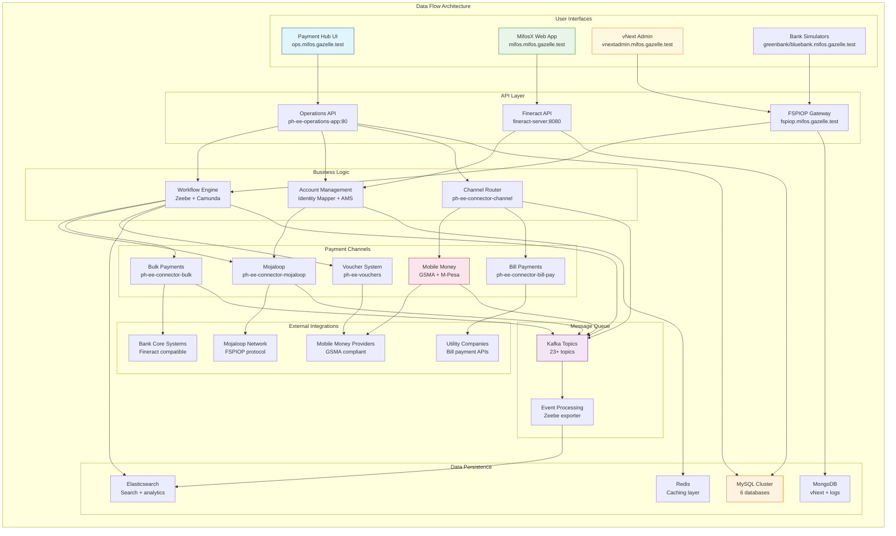

# Mifos Gazelle - Complete Technical Analysis & Architecture Guide

## 📋 Project Overview

**Mifos Gazelle** is a comprehensive deployment utility that enables rapid deployment of three Digital Public Goods (DPGs) as part of a Digital Public Infrastructure (DPI) showcase and laboratory environment.

### 🎯 Core Purpose
- **Primary Goal**: Trivially simple installation and configuration of DPGs for DPI demonstration
- **Target Audience**: Developers, testers, and educational environments  
- **Use Case**: Demo, test, and educational purposes (NOT production-ready)
- **Deployment Time**: ~15 minutes with reasonable hardware

### 🏗️ Architecture Components
The system deploys three integrated financial technology platforms:

1. **🏦 MifosX** - Core banking platform with Apache Fineract backend
2. **💳 Payment Hub Enterprise Edition (PH-EE)** - Payment processing & workflow engine
3. **🔄 Mojaloop vNext** - Interoperable payment switch with Testing Toolkit

### ⚙️ System Requirements
- **OS**: Ubuntu 22.04 or 24.04 LTS
- **Architecture**: x86_64 (ARM64 limited support)
- **Memory**: 32GB RAM minimum
- **Storage**: 30GB+ free space in home directory
- **User**: Non-root user with sudo privileges

### 🚀 Quick Start
```bash
sudo ./run.sh -u $USER -m deploy -d true -a all
```

---

## 🏗️ System Architecture

### Infrastructure Overview

```mermaid
graph TB
    subgraph "External Access"
        U1[User Browser]
        U2[Mobile App]
        U3[API Client]
    end

    subgraph "Ingress Layer"
        NGINX[Nginx Ingress Controller]
    end

    subgraph "Infrastructure Namespace"
        KAFKA[Kafka 19.0.2<br/>9092]
        MONGO[MongoDB 5.0.18<br/>27017]
        MYSQL[MySQL 5.7<br/>3306]
        REDIS[Redis 17.11.6<br/>6379]
        ES[Elasticsearch 19.9.2<br/>9200]
        KIBANA[Kibana 7.16.3<br/>5601]
        ME[Mongo Express<br/>8081]
        RC[Redpanda Console<br/>8080]
    end

    subgraph "Payment Hub EE Namespace"
        OPSAPP[ph-ee-operations-app<br/>v1.17.1:80]
        OPSWEB[ph-ee-operations-web<br/>dev1:80]
        
        subgraph "Connectors"
            BULK[ph-ee-connector-bulk<br/>8443]
            CHANNEL[ph-ee-connector-channel<br/>8443]
            MOJALOOP[ph-ee-connector-mojaloop<br/>v1.5.0]
            AMS[ph-ee-connector-ams-mifos<br/>80/70]
            MOCK[ph-ee-connector-mock-payment<br/>8080]
            NOTIFY[ph-ee-connector-notifications]
            CRM[ph-ee-connector-crm]
            BILLPAY[ph-ee-connector-bill-pay<br/>8080]
            GSMA[ph-ee-connector-gsma]
            MPESA[ph-ee-connector-mpesa]
        end
        
        IAM[ph-ee-identity-account-mapper<br/>80]
        VOUCH[ph-ee-vouchers<br/>80]
        MSG[ph-ee-messagegateway]
        
        subgraph "Workflow Engine"
            ZEEBE[Zeebe Engine]
            ZGW[Zeebe Gateway<br/>26500]
            ZOP[Zeebe Operate<br/>8080]
        end
        
        MINIO[Minio Object Storage<br/>9000]
        PHES[ph-ee-elasticsearch<br/>9200]
        PHKIB[ph-ee-kibana<br/>5601]
        TEST[ph-ee-integration-test<br/>v1.6.2]
    end

    subgraph "MifosX Namespace"
        FINERACT[Fineract Server<br/>develop:8080]
        WEBAPP[Community App<br/>80]
    end

    subgraph "vNext Namespace"
        VADMIN[vNext Admin UI<br/>80]
        FSPIOP[FSPIOP Gateway<br/>80]
        GREEN[Green Bank Backend<br/>80]
        BLUE[Blue Bank Backend<br/>80]
        TTK[TTK Hub]
    end

    subgraph "Mobile Money Channels"
        GSMAPI[GSMA API<br/>channel.local]
        MPESAPI[M-Pesa API<br/>mpesahostname]
        MERCHANT[Merchant Pay API]
        BILLS[Bill Pay API<br/>channel-gsma.local]
    end

    U1 --> NGINX
    U2 --> NGINX
    U3 --> NGINX

    NGINX --> OPSWEB
    NGINX --> VADMIN
    NGINX --> WEBAPP
    NGINX --> ME
    NGINX --> RC
    NGINX --> KIBANA
    NGINX --> PHKIB
    NGINX --> ZGW
    NGINX --> ZOP
    NGINX --> MINIO
    NGINX --> BULK
    NGINX --> MOCK
    NGINX --> FSPIOP
    NGINX --> GREEN
    NGINX --> BLUE

    OPSWEB --> OPSAPP
    OPSAPP --> BULK
    OPSAPP --> CHANNEL
    OPSAPP --> IAM
    OPSAPP --> VOUCH
    OPSAPP --> MSG

    CHANNEL --> GSMA
    CHANNEL --> MPESA
    CHANNEL --> BILLPAY
    CHANNEL --> GSMAPI
    CHANNEL --> MPESAPI
    CHANNEL --> MERCHANT
    CHANNEL --> BILLS

    BULK --> MOJALOOP
    AMS --> FINERACT
    WEBAPP --> FINERACT

    OPSAPP --> KAFKA
    FINERACT --> MYSQL
    VADMIN --> MONGO
    OPSAPP --> REDIS

    ZEEBE --> KAFKA
    ZGW --> ZEEBE
    ZOP --> ZEEBE

    PHES --> ES
    PHKIB --> PHES

    TEST --> OPSAPP
    TEST --> BULK
    TEST --> CHANNEL
    TEST --> IAM
    TEST --> AMS
    TEST --> MOCK
    TEST --> VOUCH
    TEST --> BILLPAY

    style NGINX fill:#e1f5fe
    style KAFKA fill:#fff3e0
    style MONGO fill:#e8f5e8
    style MYSQL fill:#fff3e0
    style OPSAPP fill:#f3e5f5
    style FINERACT fill:#e1f5fe
    style VADMIN fill:#fff8e1
```



### Data Flow & Component Interactions



---

## 🛠️ Infrastructure Components (Namespace: infra)

### Repository Details
- **Helm Chart**: `gazelle-infra v0.1.0`
- **Chart Location**: `src/deployer/helm/infra/`
- **Namespace**: `infra`
- **Release Name**: `infra`

### Complete Infrastructure Microservices

| Service | Image/Version | Port | Purpose | Access URL |
|---------|---------------|------|---------|------------|
| **kafka** | bitnami/kafka:19.0.2 | 9092 | Message queuing backbone | kafka.infra.svc.cluster.local |
| **zookeeper** | bitnami (via kafka) | 2181 | Kafka coordination | - |
| **mongodb** | bitnami/mongodb:5.0.18-debian-11-r8 | 27017 | Document database (vNext) | mongodb.infra.svc.cluster.local |
| **mongo-express** | mongo-express:1.0.2 | 8081 | MongoDB admin UI | mongoexpress.mifos.gazelle.test |
| **redis** | bitnami/redis:17.11.6 | 6379 | Caching & session store | redis-master.infra.svc.cluster.local |
| **mysql** | bitnami/mysql:5.7 | 3306 | Relational database | mysql.infra.svc.cluster.local |
| **elasticsearch** | bitnami/elasticsearch:19.9.2 | 9200 | Search & analytics engine | infra-elasticsearch.infra.svc.cluster.local |
| **kibana** | kibana:7.16.3 | 5601 | Log visualization | kibana.mifos.gazelle.test |
| **redpanda-console** | redpanda/console:0.6.6 | 8080 | Kafka management UI | kafkaconsole.mifos.gazelle.test |

### Database Configurations

#### MySQL Configuration
```yaml
mysql:
  rootPassword: "mysqlpw"
  username: "mifos"
  password: "password"
  databases:
    - tenants                    # MifosX tenant metadata
    - messagegateway            # PH-EE message gateway
    - identity_account_mapper   # PH-EE account mapping
    - voucher_management        # PH-EE voucher system
    - fineract_tenants         # MifosX tenant configs
    - fineract_default         # MifosX default tenant
  image: "5.7"
  persistence: false
```

#### MongoDB Configuration
```yaml
mongodb:
  rootUser: "root"
  rootPassword: "mongoDbPas42"
  databases: ["mlos"]
  usernames: ["mojaloop"]
  passwords: ["password"]
  image: "5.0.18-debian-11-r8"
  persistence: false
```

#### Kafka Topic Configuration
Kafka is provisioned with 23+ topics for inter-service communication:

| Topic Category | Topics | Purpose |
|----------------|--------|---------|
| **Account Lookup** | AccountLookupBcRequests<br>AccountLookupBcEvents<br>AccountLookupBcResponses<br>AccountLookupBcErrors | Directory service lookups |
| **Quoting** | QuotingBcRequests<br>QuotingBcEvents<br>QuotingBcErrors | Transaction quotes and pricing |
| **Transfers** | TransfersBcRequests<br>TransfersBcEvents<br>TransfersBcErrors<br>TransfersBcTimeouts | Fund transfers and processing |
| **Settlements** | SettlementsBcRequests<br>SettlementsBcEvents<br>SettlementsBcCommands | Settlement processing |
| **Platform** | PlatformConfigurationBcEvents<br>ParticipantsBcEvents | Platform management |
| **Security** | SecurityBcAuthorizationEvents<br>SecurityBcEvents | Authentication and authorization |
| **Scheduling** | SchedulingBcCommands<br>SchedulingBcEvents | Task scheduling |
| **Operations** | OperatorBcErrors | Operational events |
| **General** | KAFKA_AUDITS_TOPIC (audits)<br>KAFKA_LOGS_TOPIC (logs) | System auditing and logging |

---

## 🏦 MifosX Components (Namespace: mifosx)

### Repository Details
- **Repository**: https://github.com/openMF/mifosx-docker.git
- **Branch**: mifos-gazelle_1
- **Namespace**: mifosx
- **Technology Stack**: Java/Spring (Apache Fineract) + AngularJS

### MifosX Microservices

| Service | Image | Purpose | Port | Access URL |
|---------|-------|---------|------|------------|
| **fineract-server** | `openmf/fineract:develop` | Core banking backend | 8080 | fineract.mifos.gazelle.test |
| **community-app** | (Integrated) | Web frontend | 80 | mifos.mifos.gazelle.test |

### Database Architecture
```sql
-- Core MifosX Databases:
CREATE DATABASE IF NOT EXISTS `fineract_tenants`;    -- Tenant metadata
CREATE DATABASE IF NOT EXISTS `fineract_default`;    -- Default tenant data

-- Multi-tenant Databases:
CREATE DATABASE IF NOT EXISTS `greenbank`;           -- Green Bank tenant
CREATE DATABASE IF NOT EXISTS `bluebank`;            -- Blue Bank tenant
```

### Tenant Configuration Management
CSV-based tenant configuration with the following structure:

| Field | Purpose | Example |
|-------|---------|---------|
| **tenant_id** | Unique identifier | 2, 3 |
| **tenant_identifier** | Short name | greenbank, bluebank |
| **tenant_name** | Display name | "Greenbank tenant" |
| **tenant_timezone** | Timezone setting | "Australia/Adelaide" |
| **db_host** | Database host | mysql.infra.svc.cluster.local |
| **db_port** | Database port | 3306 |
| **db_name** | Database name | greenbank, bluebank |
| **db_user** | Database user | root |
| **db_password** | Database password | mysqlpw |

### Access Credentials
| Service | URL | Default Credentials | Notes |
|---------|-----|-------------------|-------|
| **Web Application** | http://mifos.mifos.gazelle.test | mifos/password | tenant: default |
| **API Endpoint** | http://fineract.mifos.gazelle.test | mifos/password | REST API access |
| **Swagger UI** | http://fineract.mifos.gazelle.test/fineract-provider/api-docs/ | - | API documentation |

---

## 💳 Payment Hub Enterprise Edition (Namespace: paymenthub)

### Repository Details
- **Repository**: https://github.com/openMF/ph-ee-env-labs.git
- **Version**: v1.13.0
- **Branch**: master
- **Namespace**: paymenthub
- **Helm Release**: phee

### Core PH-EE Microservices

#### Frontend & Backend Services
| Service | Image | Version | Port | Purpose | Access URL |
|---------|-------|---------|------|---------|------------|
| **ph-ee-operations-app** | openmf/ph-ee-operations-app | v1.17.1 | 80 | Backend API services | ops.mifos.gazelle.test/api/v1 |
| **ph-ee-operations-web** | openmf/ph-ee-operations-web | dev1 | 80 | Frontend dashboard | ops.mifos.gazelle.test |
| **ph-ee-integration-test** | openmf/ph-ee-integration-test | v1.6.2-gazelle | - | Automated testing | - |

#### Payment Connector Services
| Service | Image | Version | Port | Purpose | Configuration |
|---------|-------|---------|------|---------|---------------|
| **ph-ee-connector-mojaloop** | openmf/ph-ee-connector-mojaloop | v1.5.0 | - | Mojaloop integration | FSPIOP protocol |
| **ph-ee-connector-bulk** | - | - | 8443 | Bulk payment processing | bulk-connector.mifos.gazelle.test |
| **ph-ee-connector-channel** | - | - | 8443 | Channel management | HTTPS backend, GSMA API |
| **ph-ee-connector-ams-mifos** | - | - | 80/70 | AMS connector | Fineract integration |
| **ph-ee-connector-mock-payment** | - | - | 8080 | Payment simulation | mockpayment.mifos.gazelle.test |
| **ph-ee-connector-notifications** | - | - | - | Event notifications | notifications.mifos.gazelle.test |
| **ph-ee-connector-crm** | - | - | - | CRM integration | - |
| **ph-ee-connector-bill-pay** | - | - | 8080 | Bill payments | Disabled by default |
| **ph-ee-connector-gsma** | - | - | - | GSMA Mobile Money | channel-gsma.local |
| **ph-ee-connector-mpesa** | - | - | - | M-Pesa integration | PAYBILL_MPESA_CONNECTOR |

#### Support Services
| Service | Purpose | Port | Configuration | Access URL |
|---------|---------|------|---------------|------------|
| **ph-ee-identity-account-mapper** | Account resolution service | 80 | /benficiary path | - |
| **ph-ee-vouchers** | Digital voucher management | 80 | voucher_management database | - |
| **ph-ee-messagegateway** | Message gateway service | - | messagegateway database | - |
| **ph-ee-elasticsearch** | Search and analytics | 9200 | esJavaOpts: "-Xms512m -Xmx512m" | elastic-phee.mifos.gazelle.test |
| **ph-ee-kibana** | Log visualization | 5601 | elasticsearchHosts: http://ph-ee-elasticsearch:9200 | kibana-phee.mifos.gazelle.test |
| **minio** | S3-compatible object storage | 9000 | bucket: paymenthub | minio.mifos.gazelle.test |

#### Workflow Engine Services
| Service | Purpose | Port | Access URL | Configuration |
|---------|---------|------|------------|---------------|
| **zeebe** | Workflow orchestration engine | - | - | Kafka exporter enabled |
| **zeebe-gateway** | Gateway for Zeebe cluster | 26500 | zeebe-gateway.mifos.gazelle.test | Ingress enabled |
| **zeebe-operate** | Workflow monitoring UI | 8080 | zeebe-operate.mifos.gazelle.test | ingress disabled by default |

### Mobile Money & Payment Channels

#### Channel APIs
| Channel | Purpose | API Endpoints | Features | Configuration |
|---------|---------|---------------|----------|---------------|
| **GSMA Mobile Money** | GSMA standard compliance | `/channel/gsma/transfer`, `/channel/gsma/transaction`, `/channel/gsma/deposit` | P2P transfers, transactions, international remittance | channel.local |
| **M-Pesa Integration** | Safaricom M-Pesa support | `/validation`, `/confirmation` | PAYBILL, BUYGOODS scenarios | {{mpesahostname}} |
| **Merchant Pay** | Merchant payment processing | `/channel/{provider}/merchantpay` | Multi-provider support | channel.local |
| **Bill Pay** | Utility bill payments | `/bills/{billReference}/payments` | Partial/full bill payments | channel-gsma.local |
| **GSMA Simulator** | Testing & development | `/heartbeat`, `/statemententries/{ref}`, `/responses/{id}` | Bill payments, statement queries | channel-gsma.local |

#### Mobile Money Transaction Types
| Scenario | Sub-Scenario | Initiator | Description |
|----------|--------------|-----------|-------------|
| **MPESA** | BUYGOODS | PAYEE | Merchant payments |
| **MPESA** | PAYBILL | PAYER | Bill payments |
| **Transfer** | P2P | PAYER | Peer-to-peer transfers |
| **Deposit** | International | PAYEE | Cross-border remittance |

### Configuration Parameters

#### Operations Web Configuration
```yaml
operations_web:
  backend:
    PH_OPS_BACKEND_SERVER_URL: "https://ops.mifos.gazelle.test/api/v1"
    PH_VOU_BACKEND_SERVER_URL: "https://ops.mifos.gazelle.test/api/v1"
    PH_ACT_BACKEND_SERVER_URL: "https://ops.mifos.gazelle.test"
    PH_OPS_BULK_CONNECTOR_URL: "https://bulk-connector.mifos.gazelle.test"
    PH_OPS_SIGNATURE_URL: "https://ops.mifos.gazelle.test/api/v1/util/x-signature"
    PH_PLATFORM_TENANT_ID: "greenbank"
    PH_PLATFORM_TENANT_IDS: "greenbank,bluebank"
  auth:
    PH_AUTH_ENABLED: false
    PH_OAUTH_ENABLED: false
```

#### Integration Test Endpoints
Complete microservice endpoints discovered from integration test configuration:

```yaml
OPERATIONS_APP_CONTACTPOINT: "http://ph-ee-operations-app:80"
BULK_PROCESSOR_CONTACTPOINT: "https://ph-ee-connector-bulk:8443"
CHANNEL_CONNECTOR_CONTACTPOINT: "https://ph-ee-connector-channel:8443"
IDENTITY_ACCOUNT_MAPPER_CONTACTPOINT: "http://ph-ee-identity-account-mapper:80"
MIFOS_CONNECTOR_CONTACTPOINT: "http://ph-ee-connector-ams-mifos:80"
AMSMIFOS_MOCK_BASE_URL: "http://ph-ee-connector-ams-mifos:70"
MOCK_PAYMENT_SCHEMA_CONTACTPOINT: "http://ph-ee-connector-mock-payment-schema:8080"
VOUCHER_MANAGEMENT_CONTACTPOINT: "http://ph-ee-vouchers:80"
BILLPAY_CONTACTPOINT: "http://ph-ee-connector-bill-pay:8080"
PAYBILL_MPESA_CONNECTOR_CONTACTPOINT: "(TBD)"
```

---

## 🔄 Mojaloop vNext Components (Namespace: vnext)

### Repository Details
- **Repository**: https://github.com/mojaloop/platform-shared-tools.git
- **Branch**: beta1
- **Namespace**: vnext
- **Technology**: TypeScript (45.7%), HTML (22.6%), Shell (9.8%)

### Deployment Architecture
vNext is deployed in 4 sequential layers from Kubernetes manifests:

| Layer | Directory | Purpose | Components |
|-------|-----------|---------|------------|
| **crosscut** | `manifests/crosscut` | Cross-cutting concerns | Shared services, configuration |
| **ttk** | `manifests/ttk` | Testing Toolkit | BlueBank, GreenBank simulators |
| **apps** | `manifests/apps` | Core applications | Admin UI, FSPIOP gateway |
| **reporting** | `manifests/reporting` | Monitoring/reporting | Dashboards, metrics |

### vNext Microservices

#### Core Applications
| Service | Purpose | Port | Access URL | Configuration |
|---------|---------|------|------------|---------------|
| **vnext-admin-ui** | Administrative interface | 80 | vnextadmin.mifos.gazelle.test | Main admin dashboard |
| **fspiop-gateway** | FSPIOP API gateway | 80 | fspiop.mifos.gazelle.test | Financial services protocol |

#### Testing Toolkit (TTK) Services
| Service | Purpose | Port | Access URL | Configuration |
|---------|---------|------|------------|---------------|
| **greenbank-backend-0** | Green Bank simulator | 80 | greenbank.mifos.gazelle.test | TTK participant |
| **bluebank-backend-0** | Blue Bank simulator | 80 | bluebank.mifos.gazelle.test | TTK participant |
| **ttk-hub** | Hub simulator | - | - | Central switch simulation |

### Service Dependencies
```yaml
# vNext Infrastructure Dependencies:
mongodb: 
  host: "mongodb.infra.svc.cluster.local:27017"
  auth: "root:mongoDbPas42"
  database: "mlos"

kafka:
  brokers: "kafka.infra.svc.cluster.local:9092"
  topics: 23+ topics (shared with PH-EE)

redis:
  host: "redis-master.infra.svc.cluster.local"

elasticsearch:
  host: "infra-elasticsearch.infra.svc.cluster.local:9200"
```

---

## 📋 Complete Microservices Summary

### Infrastructure Services (9 services)
| Service | Image/Version | Port | DNS | Purpose |
|---------|---------------|------|-----|---------|
| kafka | bitnami:19.0.2 | 9092 | kafka.infra.svc.cluster.local | Message backbone |
| zookeeper | - | 2181 | - | Kafka coordination |
| mongodb | 5.0.18-debian-11-r8 | 27017 | mongodb.infra.svc.cluster.local | Document DB |
| mongo-express | 1.0.2 | 8081 | - | MongoDB UI |
| redis | bitnami:17.11.6 | 6379 | redis-master.infra.svc.cluster.local | Cache |
| mysql | 5.7 | 3306 | mysql.infra.svc.cluster.local | SQL DB |
| elasticsearch | bitnami:19.9.2 | 9200 | infra-elasticsearch.infra.svc.cluster.local | Search |
| kibana | 7.16.3 | 5601 | - | Log viz |
| redpanda-console | 0.6.6 | 8080 | - | Kafka UI |

### Payment Hub EE Services (21 services)
| Service | Image/Version | Port | Purpose |
|---------|---------------|------|---------|
| ph-ee-operations-app | openmf:v1.17.1 | 80 | Backend API |
| ph-ee-operations-web | openmf:dev1 | 80 | Frontend UI |
| ph-ee-connector-mojaloop | openmf:v1.5.0 | - | Mojaloop integration |
| ph-ee-connector-bulk | - | 8443 | Bulk payments |
| ph-ee-connector-channel | - | 8443 | Channel management |
| ph-ee-connector-ams-mifos | - | 80/70 | Fineract integration |
| ph-ee-connector-mock-payment | - | 8080 | Payment simulation |
| ph-ee-connector-notifications | - | - | Event notifications |
| ph-ee-connector-crm | - | - | CRM integration |
| ph-ee-connector-bill-pay | - | 8080 | Bill payments |
| ph-ee-connector-gsma | - | - | GSMA Mobile Money |
| ph-ee-connector-mpesa | - | - | M-Pesa integration |
| ph-ee-identity-account-mapper | - | 80 | Account resolution |
| ph-ee-vouchers | - | 80 | Voucher management |
| ph-ee-messagegateway | - | - | Message gateway |
| zeebe | - | - | Workflow engine |
| zeebe-gateway | - | 26500 | Workflow gateway |
| zeebe-operate | - | 8080 | Workflow UI |
| minio | - | 9000 | Object storage |
| ph-ee-elasticsearch | - | 9200 | PH-EE search |
| ph-ee-kibana | - | 5601 | PH-EE logs |
| ph-ee-integration-test | openmf:v1.6.2-gazelle | - | Automated testing |

### MifosX Services (2 services)
| Service | Image/Version | Port | Purpose |
|---------|---------------|------|---------|
| fineract-server | openmf:develop | 8080 | Core banking |
| community-app | (integrated) | 80 | Web frontend |

### vNext Services (5 services)
| Service | Purpose | Port |
|---------|---------|------|
| vnext-admin-ui | Admin interface | 80 |
| fspiop-gateway | FSPIOP API | 80 |
| greenbank-backend-0 | Bank simulator | 80 |
| bluebank-backend-0 | Bank simulator | 80 |
| ttk-hub | Testing hub | - |

### **Total: 37 Microservices**

---

## 🚀 Deployment Process

### 1. Quick Start Command
```bash
sudo ./run.sh -u $USER -m deploy -d true -a all
```

**Command Options:**
- `-u`: non-root user (required)
- `-m`: deploy|cleanapps|cleanall (operation mode)
- `-a`: all|vnext|mifosx|phee (components to deploy)
- `-d`: true|false (debug/verbose output)

### 2. Post-Deployment Access URLs

#### Main User Interfaces
| Service | URL | Purpose |
|---------|-----|---------|
| **Payment Hub UI** | http://ops.mifos.gazelle.test | Payment operations dashboard |
| **MifosX Web App** | http://mifos.mifos.gazelle.test | Core banking interface |
| **vNext Admin** | http://vnextadmin.mifos.gazelle.test | Mojaloop administration |
| **Blue Bank TTK** | http://bluebank.mifos.gazelle.test | Bank simulator |
| **Green Bank TTK** | http://greenbank.mifos.gazelle.test | Bank simulator |

#### Administrative Interfaces
| Service | URL | Purpose |
|---------|-----|---------|
| **MongoDB Express** | http://mongoexpress.mifos.gazelle.test | Database management |
| **Kafka Console** | http://kafkaconsole.mifos.gazelle.test | Message queue management |
| **Kibana** | http://kibana.mifos.gazelle.test | Log analysis |
| **PH-EE Kibana** | http://kibana-phee.mifos.gazelle.test | PH-EE specific logs |
| **Elasticsearch** | http://elastic-phee.mifos.gazelle.test | Search interface |
| **Minio** | http://minio.mifos.gazelle.test | Object storage |
| **Zeebe Operate** | http://zeebe-operate.mifos.gazelle.test | Workflow monitoring |
| **Zeebe Gateway** | http://zeebe-gateway.mifos.gazelle.test | Workflow gateway |

---

## 🔐 Security & Authentication

### Default Credentials
| Service | Username | Password | Notes |
|---------|----------|----------|-------|
| **MifosX** | mifos | password | tenant: default |
| **MySQL** | root | mysqlpw | All databases |
| **MongoDB** | root | mongoDbPas42 | vNext data |
| **Elasticsearch** | elastic | elasticSearchPas42 | Search indices |

### Security Status
```yaml
Current Security Level: DEVELOPMENT/DEMO ONLY
Recommendations:
  - Change all default passwords
  - Enable TLS/SSL for all services
  - Implement proper secret management
  - Add authentication to web interfaces
  - Enable service mesh (Istio/Linkerd)
  - Implement RBAC policies
```

---

## 🔧 Troubleshooting & Utilities

### Useful Commands
```bash
# Check all pods status
kubectl get pods --all-namespaces

# Check service endpoints
kubectl get svc --all-namespaces

# Check ingress
kubectl get ingress --all-namespaces

# MySQL client access
~/mifos-gazelle/src/utils/mysql-client-mifos.sh

# Get logs from specific pod
kubectl logs -n paymenthub ph-ee-operations-app-xxxx

# Port forward to service
kubectl port-forward -n infra svc/mysql 3307:3306
```

### Utility Scripts
| Script | Purpose | Location |
|--------|---------|----------|
| `mysql-client-mifos.sh` | MySQL database access | `src/utils/` |
| `update-mifos-tenants.sh` | MifosX tenant setup | `src/utils/` |
| `get-kube-logs.sh` | Log collection | `src/utils/` |
| `deployBpmn-gazelle.sh` | BPMN workflow deployment | `src/utils/` |

---

## 📚 Additional Resources

### Documentation Links
- **Mifos Gazelle**: https://github.com/openMF/mifos-gazelle
- **MifosX Core Banking**: https://docs.mifos.org/core-banking-and-embedded-finance/core-banking
- **Payment Hub EE**: https://mifos.gitbook.io/docs
- **Mojaloop vNext**: https://github.com/mojaloop/platform-shared-tools/blob/main/packages/deployment/docker-compose-apps/README.md

### Version Information
| Component | Version | Repository | Branch/Tag |
|-----------|---------|------------|------------|
| **Mifos Gazelle** | v1.0.0 | openMF/mifos-gazelle | master |
| **MifosX** | develop | openMF/fineract | develop |
| **Payment Hub EE** | v1.13.0 | openMF/ph-ee-env-labs | master |
| **Mojaloop vNext** | Beta1 | mojaloop/platform-shared-tools | beta1 |
| **Kubernetes** | v1.30 | K3s distribution | stable |

---

*This comprehensive analysis was generated through detailed examination of the Mifos Gazelle codebase, configuration files, and documentation as of December 2024. The document covers all 37 microservices across the three major DPG platforms.* 